# AgentNet 代码创新点拆解讲义

> 主题：Decentralized Evolutionary Coordination for LLM-based Multi-Agent Systems
> 形式：面向论文研读的代码导读 · 以直观理解优先
> 对应文件：`run_bigbenchhard_train_test.py` / `src/agent.py` / `src/agentgraph.py` / `src/pool.py` / `src/experiment.py` / `config/setting.py`

---

## 0. 一页看懂 AgentNet

AgentNet 把多智能体系统建模成一张**动态有向图**，核心思想一句话：

> **分权决策 + 边权重随成败演化 + 经验池 RAG 复用**

- 每个 Agent 是「**Router（路由决策） + Executor（执行）**」双模块节点；
- 节点间**边权重**表达协作强弱，随任务成败**动态演化**；
- 经验通过**向量检索池**沉淀复用；
- **没有中心仲裁者**——全局控制只负责喂任务、收结果、回传奖励，具体"转发/拆分/执行"全由各 Agent 自主决定。

### 系统架构总览

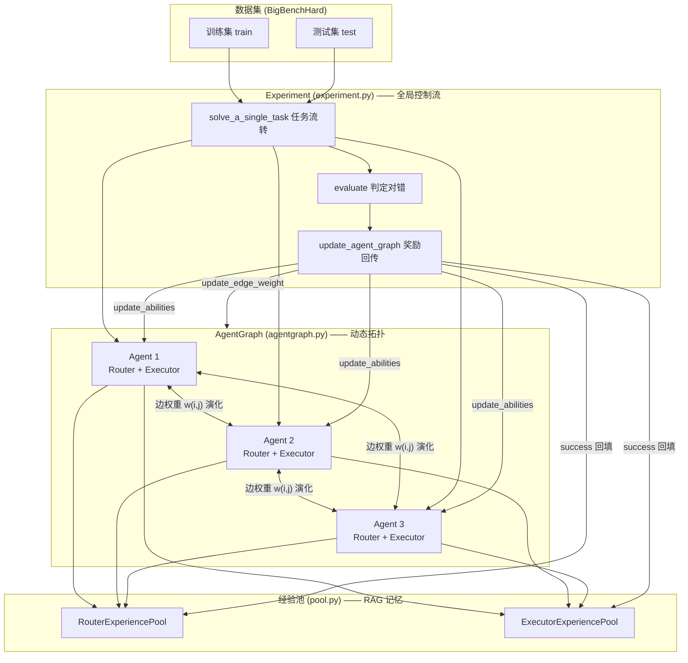

### 职责分工一览

| 类 | 文件 | 职责 |
|---|---|---|
| `Experiment` | `experiment.py` | 全局控制流、任务流转、奖励回传 |
| `AgentGraph` | `agentgraph.py` | 拓扑结构 + 边权重演化 + 入口选择 |
| `Agent` | `agent.py` | Router 决策 + Executor 执行 + 能力演化 |
| 经验池 | `pool.py` | RAG 检索 + 智能淘汰 |
| 配置/提示词 | `config/setting.py` | 能力映射 + 提示词模板 |

---

## 1. `run_bigbenchhard_train_test.py` — 实验入口

**一句话**：把 YAML 配置读进来，初始化数据集与实验，先 `fit()` 训练再 `evaluate()` 测试。

### 关键设计

| 设计点 | 说明 |
|---|---|
| **配置驱动** | Agent / 图 / 实验参数全部来自 `config/experiment/*.yaml`，改配置即改实验 |
| **数量断言** | `assert agent_num == len(agent_config)`，保证声明与实际的 Agent 数一致 |
| **全局路由开关** | `--global_router_experience`：开启则所有 Agent 共享一个全局 Router 经验池（容量 -1=无限），关闭则各自私有 |

### 核心创新：`--global_router_experience`

它是论文 **GlobalRouter 消融变体**的实现开关：

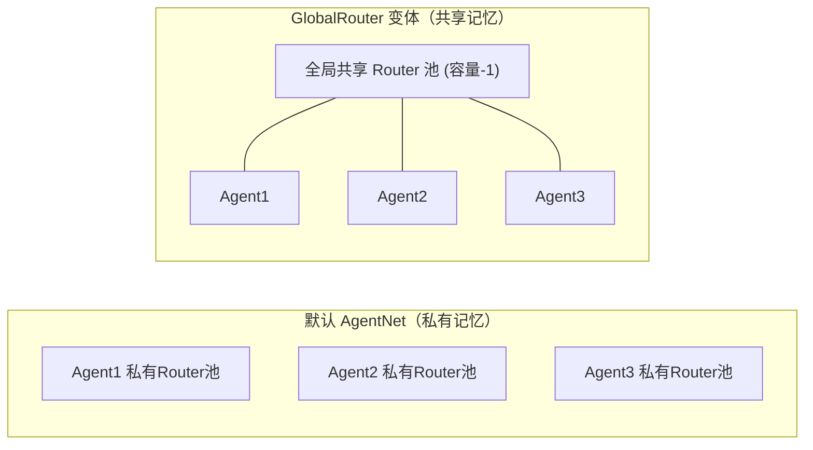

- 关闭（默认）：各 Agent 自己积累路由经验 → **私有记忆** → 促进专业分化（论文更优方案）。
- 开启：所有 Agent 看同一份经验 → 用于对比"中心化共享记忆"的效果（论文 Figure 5 的 Global Router）。

**流程**：`fit()`（训练演化）→ `evaluate()`（测试，复用训练演化的经验/边权重/能力）。

---

## 2. `src/agentgraph.py` — 动态拓扑（边权重演化）

**一句话**：维护一张有向图，边的强弱随"成功率 + 耗时"动态调整，太弱的边直接剪掉。

### 图结构三要素

| 要素 | 初始值 | 含义 |
|---|---|---|
| `edge_weight` | 全 `1.0` | 协作边强弱（论文图10的"全1初始态"） |
| `edge_success_rate` | 全 `0.0` | 该边上的历史成功率（EWMA 平滑） |
| `agent_neighbor_dict` | 全连接 | 每个 Agent 的出入邻居列表 |

### 核心创新①：边权重演化 `update_edge_weight`

对应论文 **式 2**：

```
success_rate = current_rate × 0.9 + success × 0.1     ← EWMA 平滑
success_factor = 1.1(成功) / 0.9(失败)                  ← 成败奖惩
time_factor = min(1.0, 1 / (time × 0.1))               ← 耗时惩罚（越快越高）
new_weight = current_weight × success_factor × time_factor
weight = clamp(new_weight, 0.1, 2.0)                   ← 钳制范围
```

**直观理解**：一条边如果"经常成功 + 速度快"，权重就一路上涨到上限 2.0；反之跌向 0.1。**权重 = 该协作路径的历史可信度**。

### 核心创新②：阈值剪枝（对应式 3）

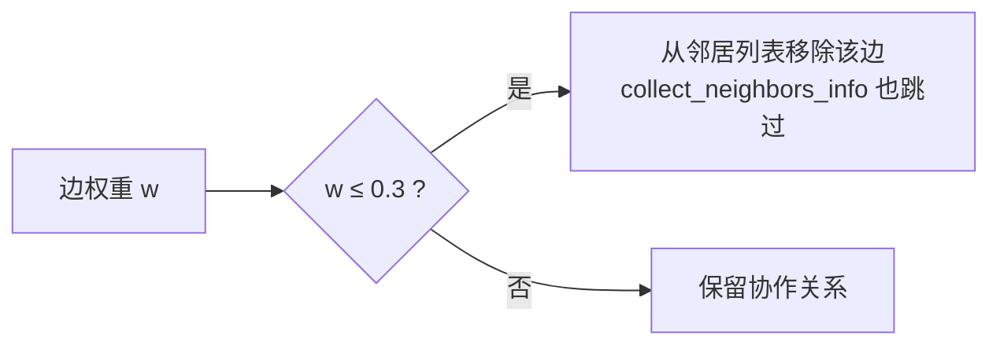

- `update_edge_weight` 里 `weight <= 0.3` 就把边从 `outcoming_agent_id` 删除；
- `collect_neighbors_info` 汇总邻居信息时同样跳过 `weight <= 0.3` 的边。

**效果**：低价值协作关系随时间被自然淘汰，图拓扑从"全连接"收敛到"高效协作子图"——即论文图 10 的三阶段演化。

### 核心创新③：能力匹配的入口选择 `select_an_agent`

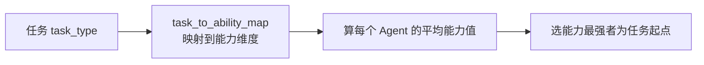

任务到来时，按能力向量把任务派给"最擅长它的 Agent"作为起点（能力打分路由的启发式版本）。

---

## 3. `src/agent.py` — 创新密度最高（Agent 本体）

**一句话**：Router 分权决策 + Executor 双阶段 RAG 执行 + 能力向量的"只奖不惩 / 用进废退"演化。

### 3.1 RouterModule — 三动作决策

**三个动作**：`forward`（转发）/ `split`（拆分）/ `execute`（执行）。

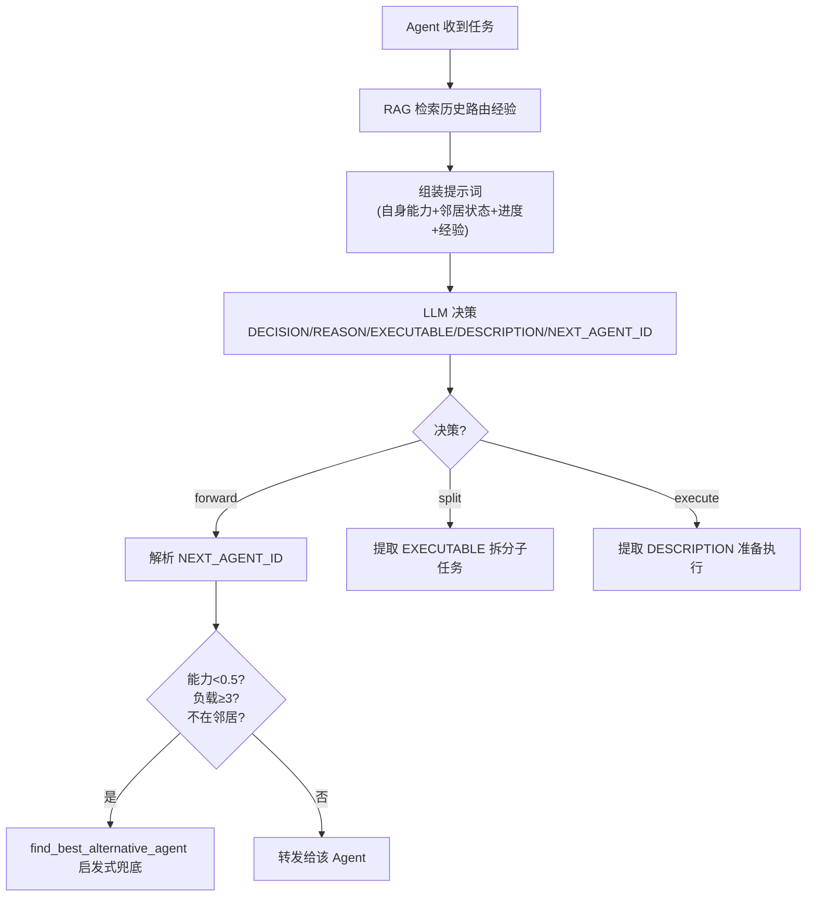

**关键健壮性设计**：LLM 给出的转发目标若不符合条件，强制回退到打分函数兜底：

```
score = ability×0.4 + (1 - load/3)×0.3 + success_rate×0.2 + (is_outgoing?1.0:0.5)×0.1
```

即 **能力优先 + 负载均衡 + 成功率 + 拓扑偏好** 的综合打分，保证 LLM 决策失败时系统仍能稳健推进。

**降级保护 `Split_and_Execute`**：当无可用邻居、或 `forward_times` 耗尽时，强制本 Agent 拆分执行，防止死循环 / 孤立 Agent 卡死。

### 3.2 ExecutorModule — 双阶段 RAG 精化检索

对应论文式 5/6（推理行动）：

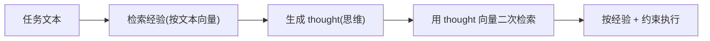

- 第一轮：按「主问题+进度+描述」向量检索相关经验；
- 第二轮：用生成的 **thought 向量**再次检索，让经验更贴合当前推理方向；
- execute（完整执行）与 split（仅拆分子任务）使用不同提示词驱动。

### 3.3 Agent 主类 — 能力向量演化（对应式 9/10）

每个 Agent 维护多维能力向量 `abilities`（reasoning / mathematical / sequence …），随任务成败演化：

**① 能力更新 `update_abilities`（只奖不惩）**

```
成功: ability += 0.1（钳制 ≤2.0）
失败: 能力不动（不惩罚）
```

> 直观理解：**"只奖励、不惩罚"** 的策略鼓励 Agent 大胆尝试执行任务（因为"转发不得分、执行成功才得分"）。这正是论文中能力"只增不减"的演化策略。

**② 跨任务能力迁移（任务相关性）**

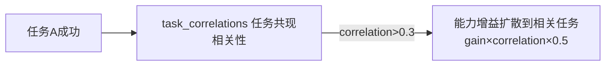

通过经验序列计算任务间共现相关性，成功时把能力增益**扩散到相关任务的能力维度**——学到一个任务的技能会部分迁移到相关任务。

**③ 能力衰减 `decay_abilities`（用进废退，对应式10）**

```
某任务类型长期不成功(倒计时归零):  ability ×= (1 - decay_rate)，下限 0.1
```

> 直观理解：不常被成功使用的技能会退化，最终形成各 Agent **术业有专攻**的专业化分化（论文图 9）。

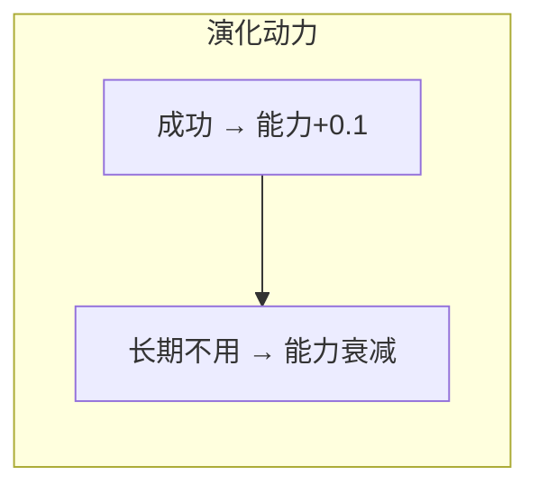

---

## 4. `src/pool.py` — RAG 记忆机制（式 4）

**一句话**：成功经验向量化存入池中，新任务按语义相似度检索复用，池满时由"智能淘汰"决定丢哪条。

### 双池 + 成功/失败分流

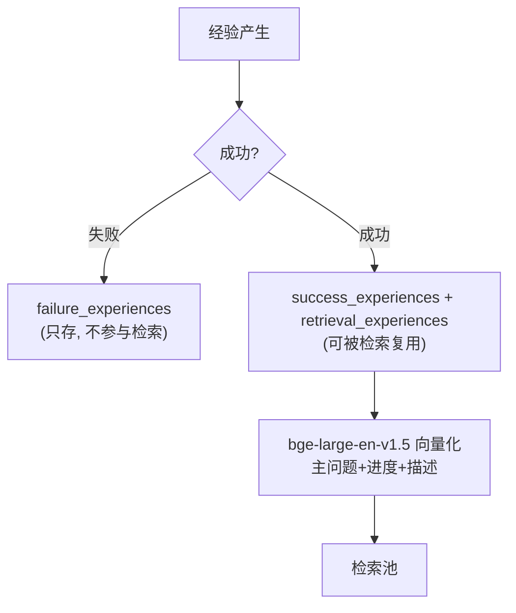

> 关键：**失败经验不进检索池**，保证检索到的都是"被验证可行"的轨迹。

### RAG 检索打分

```
scores = 余弦相似度 × (1 + 0.2 × efficiency_bonus)
efficiency_bonus = 1 / (1 + execution_time/60)    ← 执行越快权重越高
```

超过 threshold 才返回，按 top_k 截取。Executor 池还额外支持 **按 thought 向量检索**（配合 agent.py 的双阶段检索）。

### 智能淘汰 `_smart_eviction`

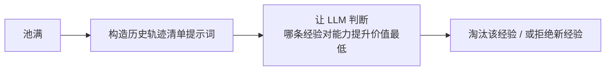

意图：让记忆管理也**智能化**（而非简单 FIFO/LRU）。

---

## 5. `src/experiment.py` — 控制流 + 奖励回传

**一句话**：负责把任务喂进图、控制 forward/split/execute 流转、判定对错、并把奖励（经验/边权重/能力）回传给链上所有 Agent。

### 任务流转主循环 `solve_a_single_task`

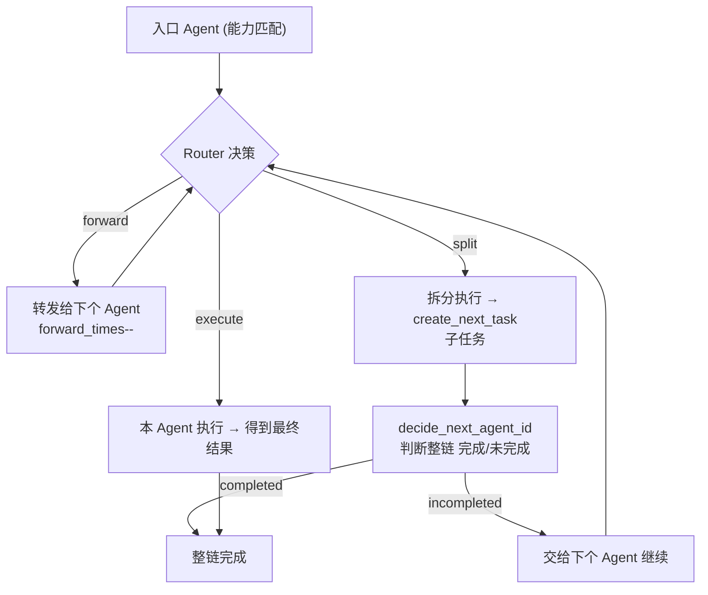

- `forward_path_max_length`：限制最大前向转发次数，防止失控；
- split 产生子任务，形成 **分叉 → 再路由** 的 DAG 式任务链。

### 奖励回传 `update_agent_graph`（学习闭环）

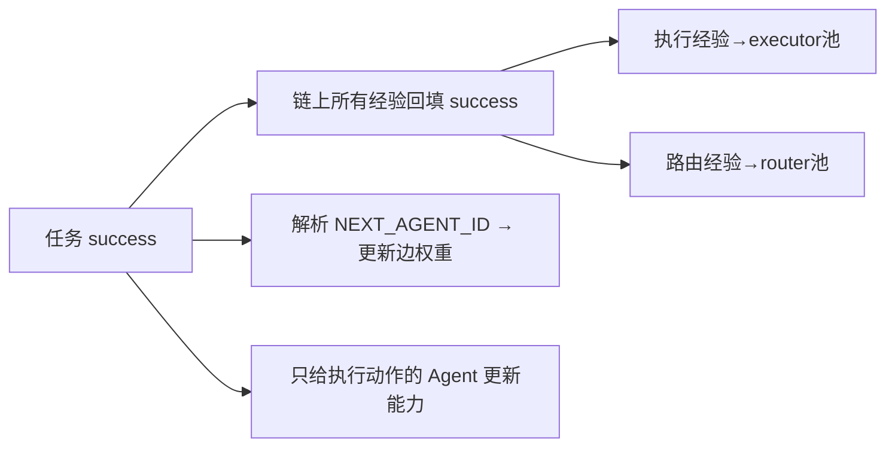

**关键激励设计**：只有**真正执行任务**的 Agent 才获得能力收益——鼓励 Agent 主动承担执行，而非甩锅转发。

**数据快照**：每个任务后把 `edge_weight / agent_info / experiences / task_history` 存 JSON——这是论文图 8/9/10（规模化、能力分化、网络演化）的数据来源。

---

## 6. `config/setting.py` — 配置 + 提示词工程

**一句话**：任务→能力映射是"能力向量路由"的地基；三套提示词承载了完整的决策逻辑。

| 配置 | 作用 |
|---|---|
| `task_to_ability_map` | 任务类型 → 能力维度集合（能力向量的地基） |
| `BASIC_PROBLEM_COMPLEXITY` | 任务基础复杂度（当前全 1.0，预留做难度感知） |
| `ROUTER_PROMPT_FORMAT` | Normal 模式：引导 split/forward/execute 权衡 |
| `ROUTER_PROMPT_DECIDE_NEXT_AGENT_ID_FORMAT` | split 后判断完成/未完成 + 选下个 Agent |

**提示词中的关键激励**：明确"**转发不得分、执行成功才得分**"——这是抑制 Agent"甩锅"、激励主动执行的核心设计。

---

## 7. 创新点 ↔ 论文公式/图表 对应速查

| 论文内容 | 代码实现 |
|---|---|
| 式 2 边权重更新 | `AgentGraph.update_edge_weight` |
| 式 3 边剪枝 | `weight ≤ 0.3` 移除边 / 跳过邻居 |
| 式 4 RAG 检索 | `pool.py` 余弦相似度 + 效率加成 |
| 式 5/6 推理行动 | `ExecutorModule` 双阶段 thought 检索 |
| 式 9 能力更新 | `Agent.update_abilities`（只奖不惩） |
| 式 10 能力衰减 | `Agent.decay_abilities`（用进废退） |
| 三动作 forward/split/execute | `RouterModule.router_decide_action` |
| 图 8 规模化 | 增加 Agent 数 / 执行器池上限，性能小幅提升 |
| 图 9 自主专业化 | `update_abilities` + `decay_abilities` 促使能力分化 |
| 图 10 网络演化 | 边权重累积 + 阈值剪枝形成协作子图 |
| Table/消融 Global Router | `--global_router_experience` 全局共享池 |

---

## 8. 代码缺陷与半成品提示（复现/理解需注意）

1. **`get_newest_experience` 切片疑似笔误**：`experiences[:-k]` 大概率应为 `[-k:]`，当前返回的是"除最后 k 条外"的经验，与函数意图相反。
2. **`RouterExperiencePool.get_relevant_experiences` 含语法错误占位** `-1 *_`，该函数当前无法正常运行（实际生效的是 Executor 池的检索实现）。
3. **`smart_eviction` 并非真正 LLM 决策**：`make_agent_decision` 实际是 `encode_model.encode` + `np.argmax(embedding)`，返回的是**向量维度下标**而非候选 task_id。论文宣称的"让 Agent 决定淘汰哪条"在代码里是**半成品实现**。
4. **边界处理不健壮**：`collect_neighbors_info` 中对 `task.task_type` 直接取值，邻居未处理过该类型任务时可能 KeyError。

---

## 9. 三句话总结

> 1. **Router 分权决策** —— 每个 Agent 自主决定 forward/split/execute，无中心仲裁；
> 2. **边权重随成败演化** —— 拓扑从全连接到高效协作子图自然收敛；
> 3. **经验池 RAG 复用 + 能力只奖不惩/用进废退** —— 记忆沉淀 + 能力专业分化。
